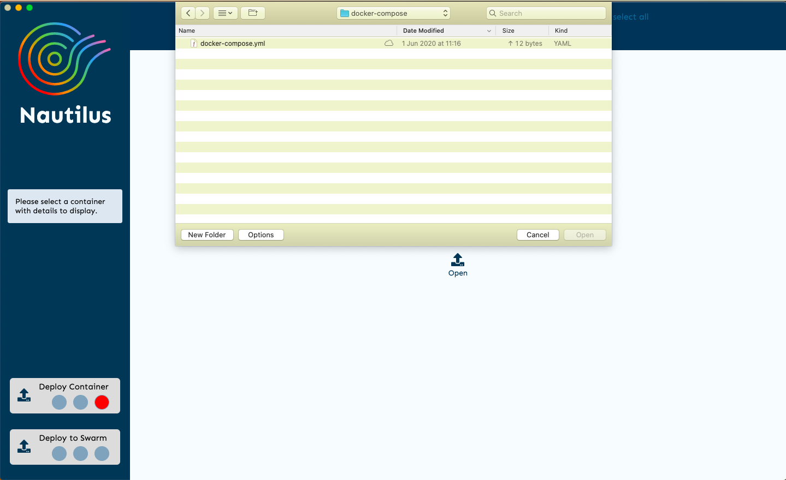
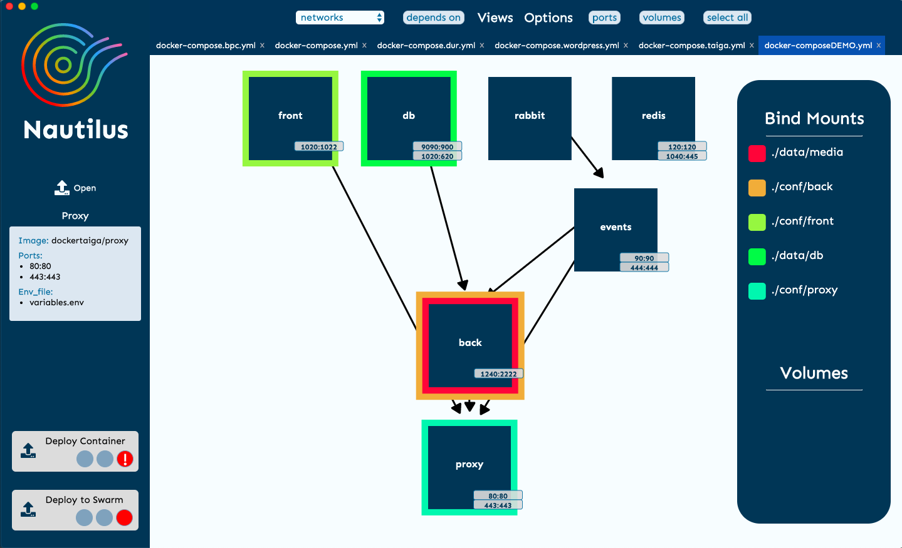
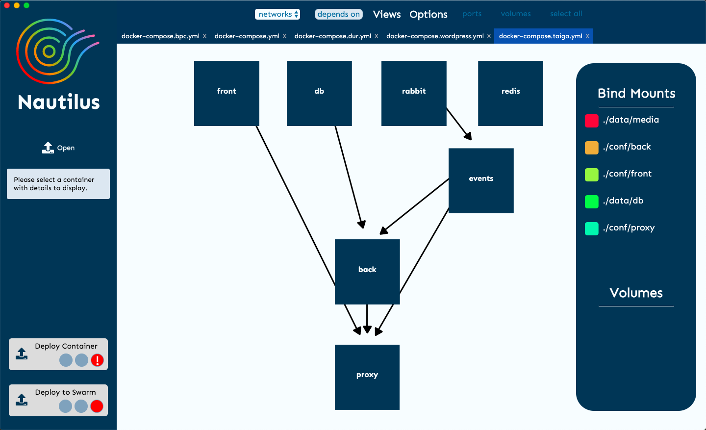
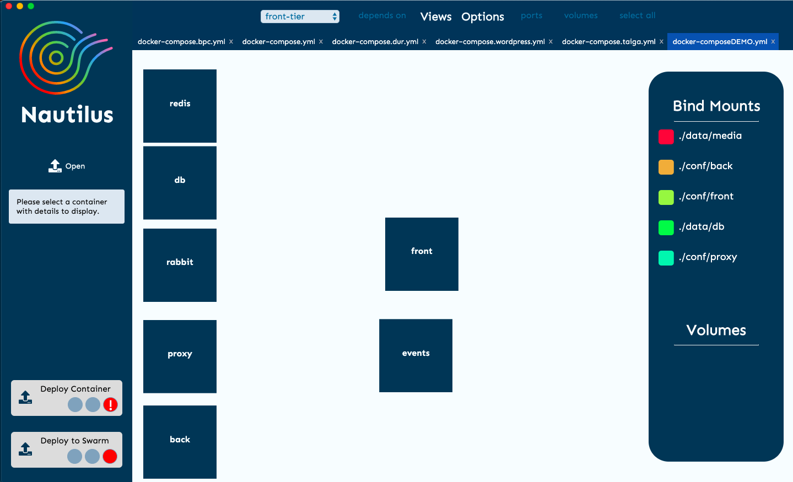
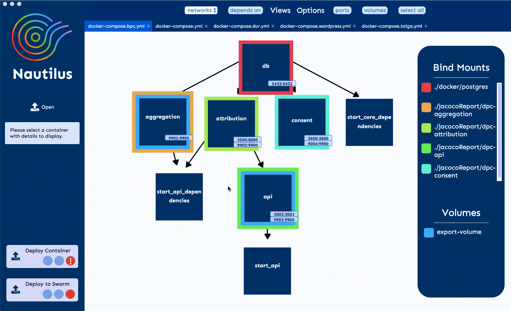
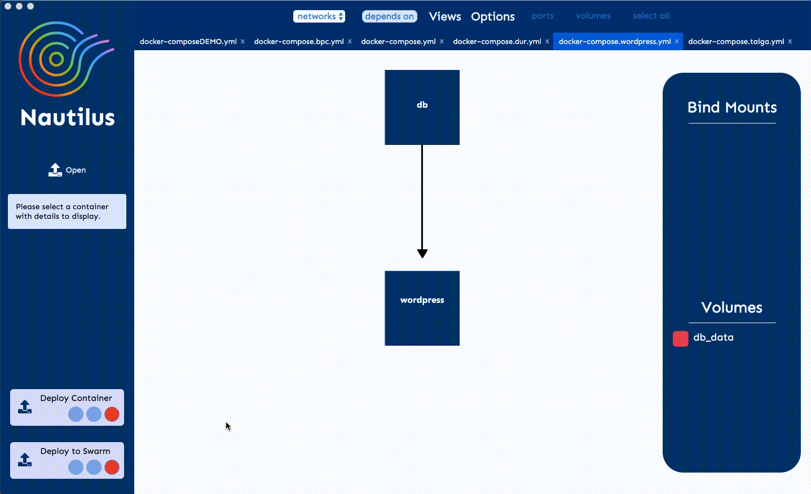
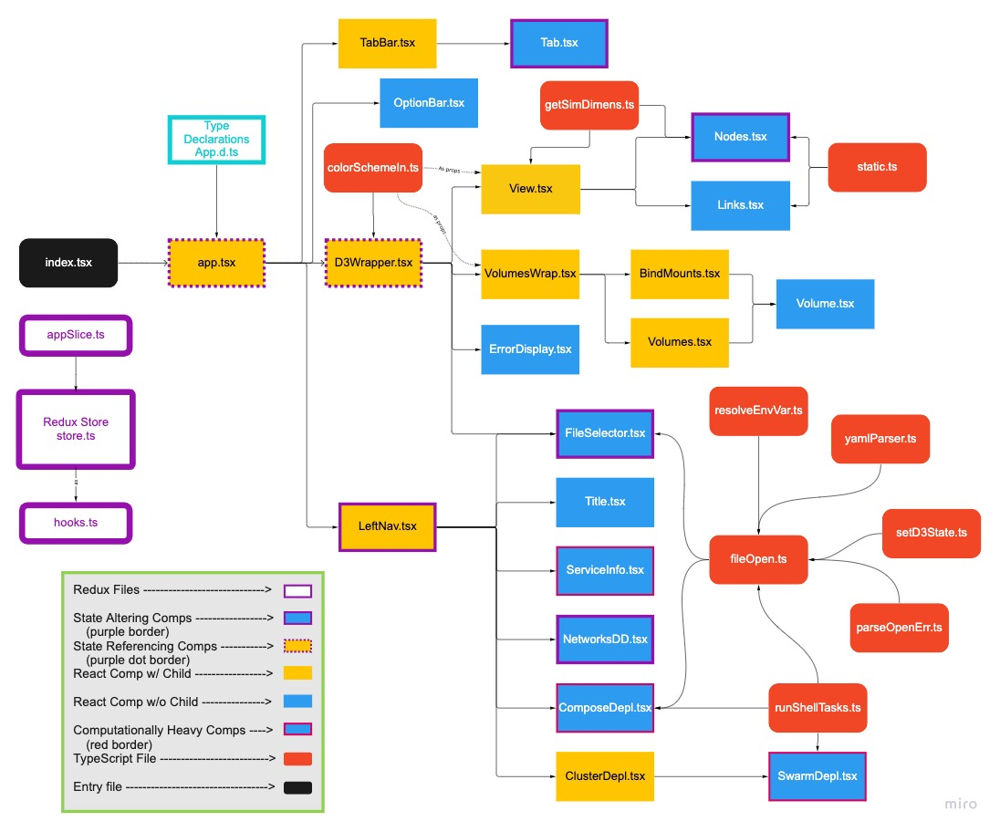

<h1 align="center">
  
</h1>

<p align="center">
  A Docker Compose Charting Tool <br><br>
  An interactive D3 visualizing tool that dynamically renders essential Docker Compose properties onto an Electron GUI, built to simplify the development environment for engineers.<br/>
  
</p>

<p align="center">
  <!-- License -->
  

  <!-- Release -->
  

  <!-- Release Date -->
  

  <!-- Test -->
  

  <!-- Typescript (Dominant Languge Used) -->
  

  <!-- Repo Size -->
  

  <!-- Contributions -->
  

  <!-- Test Coverage -->
  <!-- <a href="https://codecov.io/github/choojs/choo">
    
  </a> -->

  <!-- Stability
   -->

  <!-- Code Style -->
  
</p>

<p align="center">
  <sub> No nautili were harmed during the making of this application
  <br>
</p>

<!-- TABLE OF CONTENTS -->

## Table of Contents

- [Features](#features)
- [Getting Started](#getting-started)
  - [Prerequisites](#prerequisites)
  - [Installation](#installation)
  - [Visualizing Your Docker Compose File](#visualizing-your-docker-compose-file)
- [Contributing](#contributing)
  - [Cloning The Repo](#cloning-the-Repo)
  - [Development](#development)
  - [Packaging](#packaging)
- [Testing](#testing)
- [Technologies Used](#technologies-used)
- [License](#license)

<!-- ABOUT THE PROJECT -->

## Features

### Open your Docker Compose file

<p align="center">
  
</p>

### Display your service's info, ports and volumes

<p align="center">
  
</p>

### View your services by a container dependent view

<p align="center">
  
</p>

### View your services grouped by networks

<p align="center">
  
</p>

### View multiple Docker Compose files

<p align="center">
  
</p>

### Deploy your Docker Compose file

<p align="center">
  
</p>

### Initialize a single-node Swarm and deploy multiple stacks to it

<p align="center">
  
</p>

### Monitor resource usage

<p align="center">
  
</p>

<!-- GETTING STARTED -->

## Getting Started

Nautilus comes in a prepackaged application that is ready to run on your preferred operating system.

### **Prerequisites**

Nautilus requires the <code>docker</code> and <code>docker-compose</code> command-line interface tools installed. For Mac and Windows users, this comes included with Docker Desktop. For Linux Users, this comes included with Docker Engine.<br/><br/>
For your convenience, we've included links to Docker's documentation to set this up on your preferred operating system below.

<b>Docker Setup Instructions</b>

- [Mac](https://docs.docker.com/docker-for-mac/install/)
- [Windows](https://docs.docker.com/docker-for-windows/install/)
- [Linux](https://docs.docker.com/docker-for-mac/install/)

### **Installation**

Once you're sure you have the Docker CLI tools installed, download the Nautilus application from one of the links below.

<b>Nautilus Download Links</b>

- [Mac]Coming Soon
- [Windows]Coming Soon
- [Linux]Coming Soon

We are currently in the process of getting appropriate certifications/signatures so you may need to bypass some security warnings to run our application, but rest assured Nautilus does not make any network calls (and the project is 100% open source).

### **Visualizing Your Docker Compose File**

Run the application, open your Docker Compose file, and visualize your Docker Compose setup with the various views and options.

--- 
<!-- CONTRIBUTING -->

## Contributing

Contributions are what make the open source community such an amazing place to be learn, inspire, and create. Any contributions you make are **greatly appreciated**.

### **Cloning the Repo**

1. Fork the Project and clone the repo to your local machine
2. Install Dependencies

   Using Yarn (highly recommended):

   ```
   yarn
   ```

   Using npm:

   ```
   npm install
   ```

3. Make changes
4. Write tests for changes
5. Open a Pull Request

### **Development**

When developing, you'll probably want to run the dev version of our application. Nautilus development is fully integrated with webpack HMR, typescript and sass loaders and Electron. To start the development environment. Note: Have Eslint and Prettier installed, with your code editor set to format on save. In VSCode, you can add a rule to the settings.json "editor.

```
yarn dev
```

This will open a new instance of the Nautilus desktop application and will reload automatically as you make changes. Code away!!

### **Packaging**

Nautilus utilizes electron-builder to package the application. If you want to see the changes you've made to Nautilus in a production version of the application, use these scripts:

_Package for MacOS:_

```
yarn package-mac
```

_Package for Windows:_

```
yarn package-win
```

_Package for Linux:_

```
yarn package-linux
```

OR

_Package for all three operating systems:_

```
yarn package-all
```
---

<!-- TESTING USED -->

## Testing

The Nautilus repo is integrated with Travis CI, so tests will run automatically on all pull requests. But, we highly recommend that you test as you develop--Nautilus is a test driven development team. We have two ways to run tests:

#### #1 Run Tests for Whole Application

```
yarn test
```

Best use for `yarn test` is right before making a PR to make sure that none of your changes have broken the application.

#### #2 Run One Test File

```
yarn test-f <test-filename>
```

This command is ideal when working on a particular component to streamline development. No need to run tests for the whole application when only touching one file.

## Contributors to this Project

- v3.0: Jordan, Nathan, Giovanni, Michael
- V2.0: David, Yevgeniy, Kim, Linda
- V1.0: Aris, Danny, Josh, Michael, Tyler,

<!-- TECHNOLOGIES USED -->

## Technologies Used

- [TypeScript](https://www.typescriptlang.org/)
- [Electron](https://www.electronjs.org/)
- [D3](https://d3js.org/)
- [React with Hooks](https://reactjs.org/)
- [Redux Toolkits](https://redux-toolkit.js.org/)
- [Jest](https://jestjs.io/)
- [Enzyme](https://github.com/enzymejs/enzyme)
- [Travis CI](https://travis-ci.org/)
- [SCSS](https://sass-lang.com/)
- [Webpack](https://webpack.js.org/)
- [Babel](https://babeljs.io/)

  <!-- LICENSE -->
---
## v3.0 Update Log
#### **Index**
1. Summary of our contribution
2. Suggestions on what and where to iterate next
3. New Components Flow-Chart

### Summary of Contributions

When our team was tasked to iterate on Nautilus, we were just the third team to touch it and the first since June of 2020. Our initial intention was to build in Kubernetes visualization functionality along with some quality of life updates like Kube performance metrics and a massive overhaul to the UI and as a stretch, we planned to update the state management to use Redux in lieu of the legacy, prop drilling.
 
When we first downloaded the app, it wouldn't run on most of our computers, we had 3 M1 Macbooks and a windows 11 using WSL. It oddly ran on the 15" MBP but not the 13" MBP nor the Macbook Air or WSL. To triage, we needed to switch out many deprecated dependencies to get the application running on all systems.
 
Then we set about whiteboarding the React component tree and began to learn the codebase. During this process, we quickly realized that without overhauling the state management system, no significant changes could be made to the application.
 
We changed our immediate focus to implementing Redux Toolkits. RTK documents suggest using 'Slices' to create modular, focused reducers and effectively merging them in the store file. Previously the state changing functions were highly intertwined, forcing the priority shift but this also made it difficult to create this modularity in a timely manner so we added all state management functions to a single reducer.
 
We suggest for any newly created reducers that they be in new slices and merged in the store file for better state management modularity (1).
 
After we returned full functionality to the application with the new state changes, we made minor UI/UX changes like moving the options bar to the left nav and creating a specific view style on the left nav for Kubernetes yaml files (as opposed to Docker yaml files). We left room for performance metrics to be added on that left nav bar. (2)(3)
 
After these updates we had many minor edge case bugs related to error messages not loading/displaying, tabs not switching views or closing properly, rendering issues with the nodes, and other bugs mostly related to properly implementing Kubernetes yaml files with the existing application. The last objective post-launch is fix the testing suite which was made broken because of the state management changes.(4)

 Overall we're tremendously happy with the continued progress on Nautilus. While our team was forced to take a different turn than our initial Minimum Viable Product, the changes we made were crucial to allowing further optimization and the project is now in a great state to continue iterating upon.

### Suggestions on What and Where to Iterate
1. Dissect the current 'AppSlice' reducer so it's more modular and any new state changing functions should be in smaller, modular slices like the following:
  - Push the colorSchemeIndex functionality into a new Redux Slice
  - Modularize state management inside the D3Wrapper by removing prop drilling and using appSelector to bring in state data
2. Add Kubernetes performance metrics (container health, uptime, etc.)
3. Continue to build UI/UX specifically for Kubernetes deployments
4. Fix tests or write new tests for the application including the following:
  - If a respective tab is closing properly
  - If a respective tab is switching properly
  - If Kubernetes yaml files are appropriately changing the UI/UX
  - If the LeftNav component and its related info are appropriately picking up the same info as the main view

### Components Flow Chart
<p align="center">
  
</p>
Check the NautilX-app-Tree.jpg file in the static folder to see a higher res version

---

## License

Distributed under the MIT License. See `LICENSE` for more information.

The Nautilus Devs - [LinkedIn](https://www.linkedin.com/company/nautilusapp)
